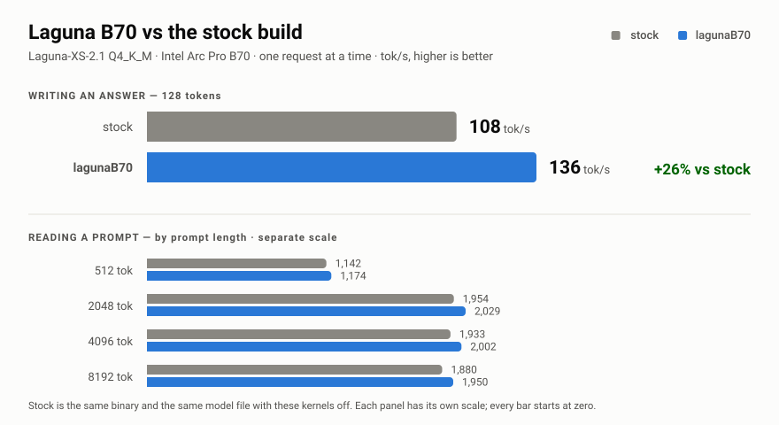
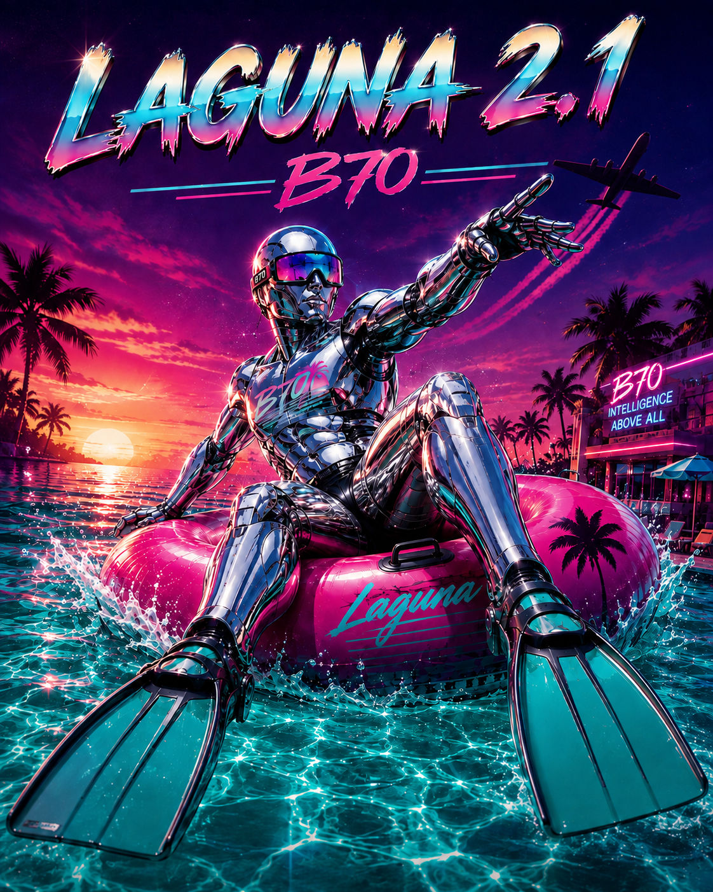

# Laguna B70

**Faster text generation for Laguna-XS-2.1 on the Intel Arc Pro B70. 108 → 136 tok/s.**

Custom llama.cpp SYCL kernels, plus the measurements that back them up.

> This is kernel work and a serving configuration for one GPU — **not a new
> model**. The weights are [poolside/Laguna-XS-2.1](https://huggingface.co/poolside/Laguna-XS-2.1)
> (Apache-2.0), unchanged. Serving package with the quant + template:
> [Frosty40/Laguna-XS-2.1-ArcB70-GGUF](https://huggingface.co/Frosty40/Laguna-XS-2.1-ArcB70-GGUF).

<p align="center">
  <picture>
    <source media="(prefers-color-scheme: dark)" srcset="assets/graphs/benchmark-dark.svg">
    
  </picture>
</p>

`stock` is the same binary and the same model file with these kernels switched off.
Both arms run one request at a time. Numbers come from one matched run —
[`results/AB_REPORT.md`](results/AB_REPORT.md), method in
[`docs/METHODOLOGY.md`](docs/METHODOLOGY.md).

<details><summary>Same numbers as a table</summary>

| | stock | lagunaB70 | |
|---|---:|---:|---:|
| Writing an answer (128 tokens) | 108 tok/s | **136 tok/s** | +26% |
| Reading a 512-token prompt | 1142 tok/s | 1174 tok/s | +3% |
| Reading a 2048-token prompt | 1954 tok/s | 2029 tok/s | +4% |
| Reading a 4096-token prompt | 1933 tok/s | 2002 tok/s | +4% |
| Reading an 8192-token prompt | 1880 tok/s | 1950 tok/s | +4% |

</details>

## How it gets faster

Generating one token spends most of its time launching lots of tiny GPU jobs and
re-reading the same weights out of memory. These kernels glue those jobs together
so the data is touched once:

- gate + up + SwiGLU as a single expert kernel
- the MoE router (top-8 of 256 experts) as one kernel, replacing a five-kernel chain
- weighted MoE-down and packed reduce
- RMS-norm + multiply, RoPE + row-store, residual adds — fused into their neighbours
- flash-attention VEC GQA on the attention path

Writing speed is where this pays off. Prompt reading was already near the card's
memory-bandwidth limit, so it gains about 3–4%.

## 2026-08-12 — the long-context stack

<p align="center"></p>

A second campaign targeted serving at the model's **full 131,072-token
window** (RL loops, long-document work). Three more env-gated kernels, tag
`lx-stack-1.4092-20260812`:

| | before | after | |
|---|---:|---:|---:|
| Reading a real 23K-token prompt (131K window) | 307 tok/s | **1,764 tok/s** | 5.75x |
| Writing at 23K tokens of context | 81.5 tok/s | **90 tok/s** | +10% |
| Writing at 122K tokens of context | 36.0 tok/s | **40.8 tok/s** | +13% |
| Writing at zero context (tg128) | 152.5 tok/s | 152.5 tok/s | held |

```bash
export GGML_SYCL_LX_REORDER_MULTICOL_MKL=1   # wide batches -> fp16/oneMKL (the 5x)
export GGML_SYCL_LX_FATTN_PARALLEL_BLOCKS=16 # flash-attn decode split-K width
export GGML_SYCL_LX_EXPERT_TILE_GEMM=1       # XMX fused dequant-GEMM for small expert batches
```

Where the 5x comes from: the first token generated permanently reorders the
weights for fast decode, after which a dispatch guard was shredding every
*prompt-reading* matmul into 8-column decode-shaped chunks. Narrowing that
guard to decode widths recovers fast prompt reading at identical writing
speed; a wider flash-attention split and an XMX expert-tile kernel add the
rest. Quality-gated the same way as everything here: bit-identical with the
kernels off, distribution-checked against a canonical fp16 reference with
the kernels on (closer to it than the previous build), and NaN-watched over
a 1,536-token generation at the full window.

## Three kernels stay off

Perplexity isolation caught three fuses corrupting logprobs or multi-token
stability, so they ship disabled:

```bash
export GGML_SYCL_DISABLE_MUL_MAT_ADD_FUSE=1
export GGML_SYCL_DISABLE_MOE_DUAL_DOWN=1
export GGML_SYCL_DISABLE_MOE_DUAL_MULTITOKEN=1
```

Turning all of them on reports a much larger prefill gain. That number is excluded
here because the model's output quality falls apart — see [`notes/`](notes).

## Run it

```bash
export ONEAPI_DEVICE_SELECTOR=level_zero:gpu
export ZE_AFFINITY_MASK=0
export GGML_SYCL_DISABLE_GRAPH=1
export GGML_SYCL_DISABLE_MUL_MAT_ADD_FUSE=1
export GGML_SYCL_DISABLE_MOE_DUAL_DOWN=1
export GGML_SYCL_DISABLE_MOE_DUAL_MULTITOKEN=1

./llama-bench -m Laguna-XS-2.1-Q4_K_M.gguf \
  -ngl 99 -t 16 -ub 2048 -b 2048 -ctk f16 -ctv f16 -fa on -r 5 -p 512 -n 0
./llama-bench -m Laguna-XS-2.1-Q4_K_M.gguf \
  -ngl 99 -t 16 -ub 2048 -b 2048 -ctk f16 -ctv f16 -fa on -r 5 -p 0 -n 128
```

| | |
|--|--|
| Model | Laguna-XS-2.1 Q4_K_M (~19 GiB) |
| Device | Intel Arc Pro B70, Level-Zero |
| Engine | llama.cpp SYCL (`ggml-sycl`) |
| Window | pp512, tg128 · 5 reps · f16 KV · flash-attn on |

## Layout

```text
assets/graphs/   the figure above, and the script that generates it
results/         A/B metrics and the report
notes/           ship note for the current kernel set
docs/            methodology
```

Measurement artifacts are MIT. Model: [poolside/Laguna-XS-2.1](https://huggingface.co/poolside/Laguna-XS-2.1)
(Apache-2.0) — all credit for the model belongs to poolside. Runtime:
[llama.cpp](https://github.com/ggml-org/llama.cpp) (ggml-org) with Intel
oneAPI / XMX. Each keeps its own license.
