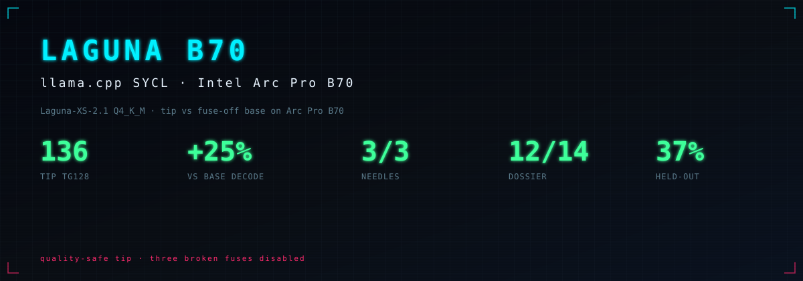
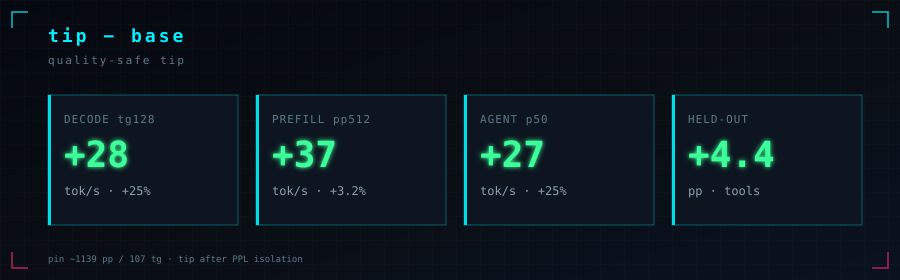
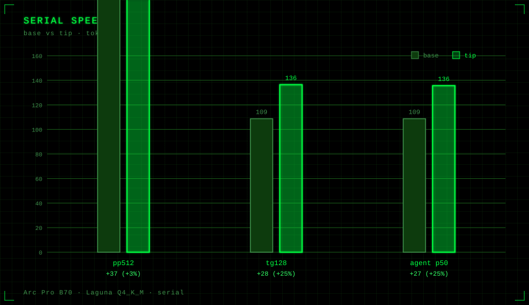
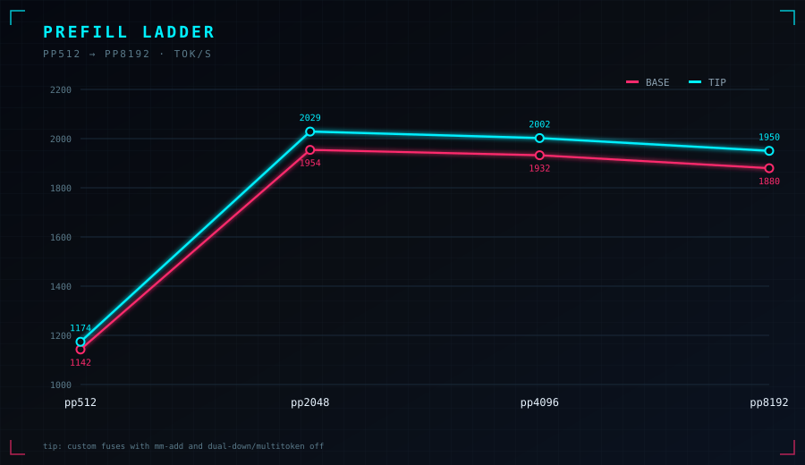

# Laguna B70

<p align="center">
  
</p>

llama.cpp **SYCL** kernel work for **Laguna-XS-2.1 Q4_K_M** on **Intel Arc Pro B70** (Level-Zero).

Serial measurement only: one stream, pp512 + tg128.

---

## Stack

Custom fuses on the MoE path (dense dual SwiGLU, router GEMV / true top-k, FA VEC GQA, residual/norm/rope fuses, weighted MoE down, packed reduce).

Three paths are left **off** after PPL isolation (they break logprobs or multitoken stability):

```bash
export GGML_SYCL_DISABLE_MUL_MAT_ADD_FUSE=1
export GGML_SYCL_DISABLE_MOE_DUAL_DOWN=1
export GGML_SYCL_DISABLE_MOE_DUAL_MULTITOKEN=1
```

That configuration is the **tip** below. **Base** is the same binary and GGUF with all major custom fuses disabled.

---

## Results (tip vs base)

Only metrics that **differ**. Matched quality checks (needles, dossier, chat content) are omitted here.

<p align="center">
  
</p>

<p align="center">
  
</p>

| Gate | base | tip | Δ |
|------|-----:|----:|--:|
| formal pp512 | 1150 | 1187 | +37 |
| formal tg128 | 109 | 136 | +28 |
| single-agent tg p50 | 109 | 136 | +27 |
| held-out tools | 32.6% | 37.0% | +4.4 pp |

<p align="center">
  
</p>

Historical pin: pp ≈ 1139 · tg ≈ 107. Tip vs pin composite ≈ +20% (`decode^0.75 * prefill^0.25`).

Details: [`results/AB_REPORT.md`](results/AB_REPORT.md) · methodology: [`docs/METHODOLOGY.md`](docs/METHODOLOGY.md)

---

## Configuration

| | |
|--|--|
| Model | Laguna-XS-2.1 Q4_K_M (~19 GiB) |
| Device | Arc Pro B70 · `ONEAPI_DEVICE_SELECTOR=level_zero:gpu` |
| Engine | llama.cpp SYCL (`ggml-sycl`) |
| Window | pp512, tg128 · 5 reps · f16 KV · flash-attn on |

```bash
export ONEAPI_DEVICE_SELECTOR=level_zero:gpu
export ZE_AFFINITY_MASK=0
export GGML_SYCL_DISABLE_GRAPH=1
export GGML_SYCL_DISABLE_MUL_MAT_ADD_FUSE=1
export GGML_SYCL_DISABLE_MOE_DUAL_DOWN=1
export GGML_SYCL_DISABLE_MOE_DUAL_MULTITOKEN=1

./llama-bench -m Laguna-XS-2.1-Q4_K_M.gguf \
  -ngl 99 -t 16 -ub 2048 -b 2048 -ctk f16 -ctv f16 -fa on -r 5 -p 512 -n 0
./llama-bench -m Laguna-XS-2.1-Q4_K_M.gguf \
  -ngl 99 -t 16 -ub 2048 -b 2048 -ctk f16 -ctv f16 -fa on -r 5 -p 0 -n 128
```

---

## Limits

- Agent Bench 69: tool schemas often need >32k context; tip server aborted under long tool load. Base 8/100 at c=32768.
- Broken full-fuse prefill “+63%” is excluded (PPL failure).
- Measurement artifacts: MIT. llama.cpp and model weights keep their own licenses.

---

## Layout

```
assets/graphs/   SVG figures (deltas only)
results/         A/B metrics and report
notes/           quality-safe tip note
docs/            methodology
```
