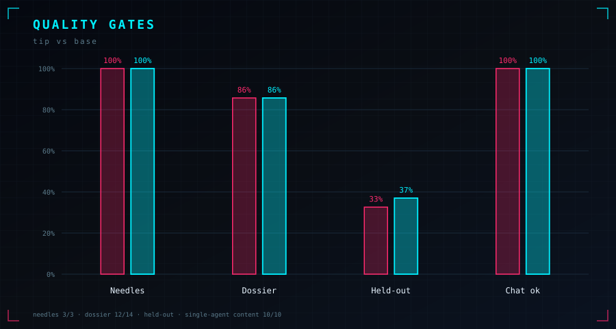

# LAGUNA B70

<p align="center">
  
</p>

**Serial SYCL kernel stack** for [Laguna-XS-2.1](https://huggingface.co/) Q4_K_M on **Intel Arc Pro B70** (Level-Zero / oneAPI).

Not multi-slot theater. Not Apple Silicon. One stream. Quality-gated speed.

---

## What this is

Custom **llama.cpp SYCL** fuses aimed at Laguna’s MoE graph on B70:

- dual SwiGLU (dense + MoE)
- router GEMV + true top-k + hybrid mode8
- FA VEC (GQA), residual / norm / rope fuses
- weighted / integrated MoE down, packed reduce

**Quality-safe tip** = that stack **minus three broken paths** proven to wreck logprobs / multitoken stability:

```bash
GGML_SYCL_DISABLE_MUL_MAT_ADD_FUSE=1
GGML_SYCL_DISABLE_MOE_DUAL_DOWN=1
GGML_SYCL_DISABLE_MOE_DUAL_MULTITOKEN=1
```

The invalid “+63%” prefill figure was the broken path. We do not claim it.

---

## Results — tip vs base (same binary, same GGUF)

**Base** = all major custom fuses OFF · **Tip** = quality-safe stack above.

<p align="center">
  
</p>

<p align="center">
  
</p>

| Gate | base | tip | Δ |
|------|-----:|----:|--:|
| formal **pp512** | 1150 | **1187** | +37 |
| formal **tg128** | 109 | **136** | **+28** |
| single-agent tg p50 | 109 | **136** | **+27** |
| needles (100 para) | 3/3 | 3/3 | = |
| dossier QA | 12/14 | 12/14 | = |
| held-out tools | 32.6% | **37.0%** | +4.4 pp |

<p align="center">
  
</p>

<p align="center">
  
</p>

**Pin** (historical control baseline): pp ≈ 1139 · tg ≈ 107.  
**Tip vs pin:** ~**+20%** composite serial score.  
**Tip vs fuse-off base:** ~**+25% decode**.

Full writeup: [`results/AB_REPORT.md`](results/AB_REPORT.md)

---

## Stack

| Piece | Detail |
|-------|--------|
| Model | Laguna-XS-2.1 Q4_K_M (~19 GiB GGUF) |
| Device | Intel Arc Pro B70 · `ONEAPI_DEVICE_SELECTOR=level_zero:gpu` |
| Engine | llama.cpp SYCL (`ggml-sycl`) control tree |
| Track | **Serial only** — pp512 + tg128, one stream |
| Harness origin | Internal `lagunaX` / Mount Doom campaign |

---

## Reproduce (measurement harness)

```bash
# Device
export ONEAPI_DEVICE_SELECTOR=level_zero:gpu
export ZE_AFFINITY_MASK=0
export GGML_SYCL_DISABLE_GRAPH=1

# Quality-safe tip kills
export GGML_SYCL_DISABLE_MUL_MAT_ADD_FUSE=1
export GGML_SYCL_DISABLE_MOE_DUAL_DOWN=1
export GGML_SYCL_DISABLE_MOE_DUAL_MULTITOKEN=1

# Point at your SYCL llama-bench + Laguna GGUF
./llama-bench -m Laguna-XS-2.1-Q4_K_M.gguf \
  -ngl 99 -t 16 -ub 2048 -b 2048 -ctk f16 -ctv f16 -fa on \
  -r 5 -p 512 -n 0     # prefill
./llama-bench -m Laguna-XS-2.1-Q4_K_M.gguf \
  -ngl 99 -t 16 -ub 2048 -b 2048 -ctk f16 -ctv f16 -fa on \
  -r 5 -p 0 -n 128     # decode
```

Score formula used in-campaign:

```
score = decode_speedup^0.75 * prefill_speedup^0.25
```

---

## What we will not claim

- Multi-slot aggregate tok/s as serial score  
- The broken full-fuse “+63%” prefill number  
- Agent Bench 69 as a tip win (tool schemas need ~35k+ ctx; tip server aborted under long tool load; base only ~8/100 on this model)  
- Bitexact identity of every fuse vs stock (numerics recaptured under golden discipline where noted)

---

## Repo layout

```
assets/graphs/     tech-noir charts (SVG)
results/           banked A/B metrics + report
notes/             quality-safe tip note
docs/              methodology
```

---

## Status

**Bankable:** quality-safe tip · decode-led ~+25% vs fuse-off base · long-context quality matched.

**Open:** fix or permanently leave dead `MUL_MAT_ADD` / MoE dual-down multitoken; harden server under Agent69 tool load; upstream PR packaging of proven fuses only.

---

## License

Measurement artifacts and notes in this repo: **MIT**.  
llama.cpp remains under its own license. Model weights under their own terms.

---

<p align="center">
  <sub>// ARC B70 · SYCL · SERIAL · QUALITY FIRST</sub>
</p>
